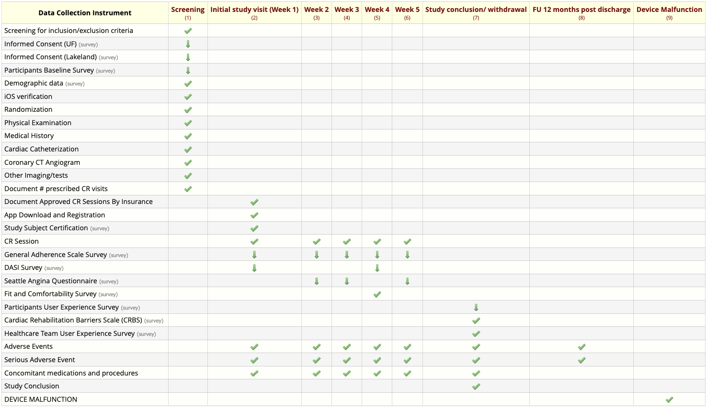

```{r setup, include = FALSE}
library(dotenv)
have_uri <- !identical(Sys.getenv("REDCAP_URI"), "")
knitr::opts_chunk$set(
  collapse = TRUE,
  comment = "#>",
  eval = have_uri
)
```

```{r no-uri-warning, eval = !have_uri, echo = FALSE, comment = NA}
message("No URI available. Code chunks will not be evaluated.")
```

```{r load-credentials-1, include=FALSE}
redcap_uri <- Sys.getenv("REDCAP_URI")
token <- Sys.getenv("DEMOGRAPHICS_TOKEN")
```

[REDCap](https://projectredcap.org/) is an electronic data capture software that is widely used in the academic research community. It provides tools building and managing online surveys and databases. These tools allow a designer to create complex data collection instruments with rich data typing, validation rules, repeating data structures, and time-series data collection and present these in a data-collection *project*. Data collected using this REDCap Project must conform the rules in the project definition. REDCap Filler provides a testing and development service for REDCap users. It generates and loads synthetic test data into a REDCap project, using the project's design to guide test data generation. This article provides a basic example using redcapfiller to populate a REDCap project.

## TL;DR

Populating a project with 5 records of data is as simple as

```{r tldr, message = FALSE}
library(redcapfiller)
generated_values <- get_project_values(redcap_uri, token)

purrr::walk(
  generated_values,
  ~ REDCapR::redcap_write(
    redcap_uri = redcap_uri,
    token = token,
    ds_to_write = .x
  )
)
```

## Generating the data

The goal of redcapfiller is to generate a test dataset as complex as the project design using nothing more than the project design. The only required inputs are `redap_uri`, the uri to a REDCap host's API interface, and `token`, an API token to a project on that host.

```{r get-project-values-example-1}
library(redcapfiller)
generated_values <- get_project_values(redcap_uri, token)
```

The object returned by `get_project_values()` is always a list.

```{r show-type-of-generated-values}
typeof(generated_values)
```

For classic projects, like this example, the list will always have length of 1. This will make more sense when we run `get_project_values()` against a longitudinal project.

```{r show-length-of-generated-values}
length(generated_values)
```

Each list element is a tibble with a filled-rectangle of data.

```{r show-generated-data}
generated_values[[1]] |>
    rmarkdown::paged_table()
```

Don't be distracted by the character data types on the numeric columns. They still conform to the project design.

## Writing the data

Writing the synthetic data to REDCap requires you walk the list to write each list element. This is easy with `purrr::walk()`

```{r write-generated-values-example-1}
purrr::walk(
  generated_values,
  ~ REDCapR::redcap_write(
    redcap_uri = redcap_uri,
    token = token,
    ds_to_write = .x
  )
)
```

## Longitudinal data

`redcapfiller` can handle longitudinal projects with any number of forms, events, and form-event relationships. The code is exactly the same as before, but the generated data is more complex. In the our longitudinal example we are adding five records to a project with this form-event matrix:



`get_project_values()` detects the longitudinal features of the project and creates a list element for each of the nine longitudinal events. Each element has data for the forms and fields on that event. 

```{r load-credentials-2, include = FALSE}
redcap_uri <- Sys.getenv("REDCAP_URI")
token <- Sys.getenv("LONGITUDINAL_TOKEN")
```

```{r get-project-values-example-2, message = FALSE}
library(redcapfiller)
generated_values <- get_project_values(redcap_uri, token)
```

```{r get-project-values-example-2-length}
length(generated_values)
```

The write operation uses the same code, but this time there are nine write events of five records each.

```{r write-generated-values-example-2}
purrr::walk(
  generated_values,
  ~ REDCapR::redcap_write(
    redcap_uri = redcap_uri,
    token = token,
    ds_to_write = .x
  )
)
```

## get_project_values() parameters

You can specify the number of records you want to generate.

```{r, include = FALSE}
redcap_uri <- Sys.getenv("REDCAP_URI")
token <- Sys.getenv("DEMOGRAPHICS_TOKEN")
```

```{r get-project-values-example-3, message = FALSE}
library(redcapfiller)
generated_values <- get_project_values(
  redcap_uri,
  token,
  number_of_records_to_populate = 10
)
```

```{r get-project-values-options-1}
generated_values[[1]] |>
  nrow()
```
In a longitudinal project, you can specify a vector of events you want to fill. 

```{r load-credentials-3, include = FALSE}
token <- Sys.getenv("LONGITUDINAL_TOKEN")
```

```{r get-project-values-example-4, message = FALSE}
library(redcapfiller)
generated_values <- get_project_values(
  redcap_uri,
  token,
  events = c("screening_arm_1", "week_2_arm_1")
)
```
```{r get-project-values-options-2}
length(generated_values)
```
